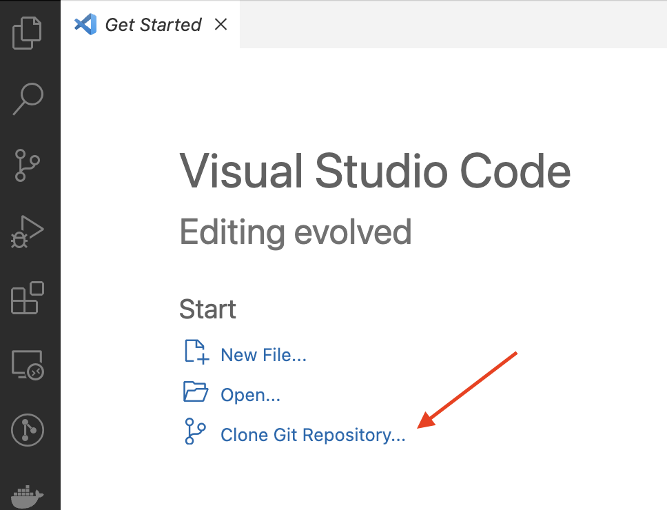
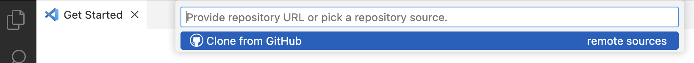
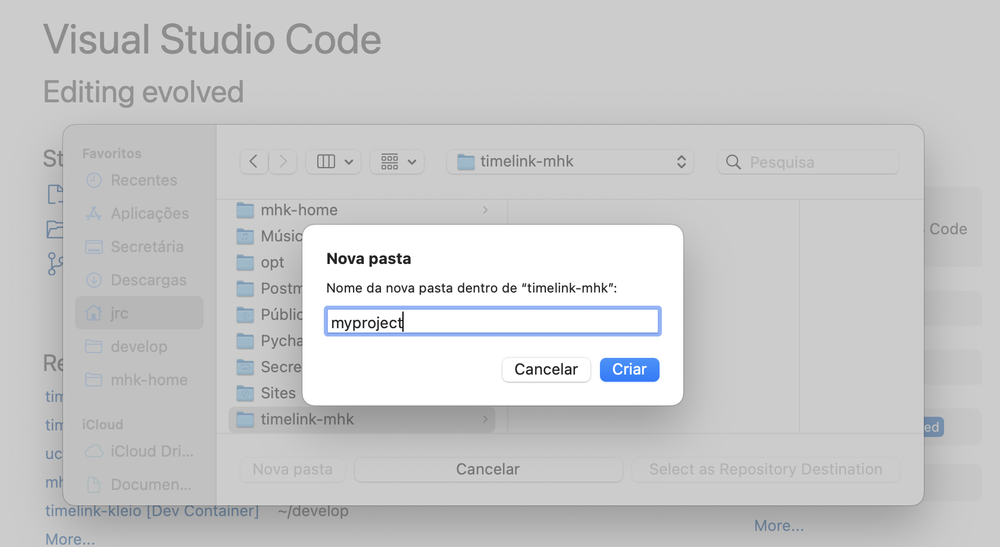
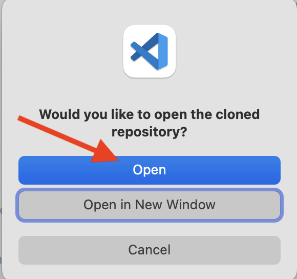
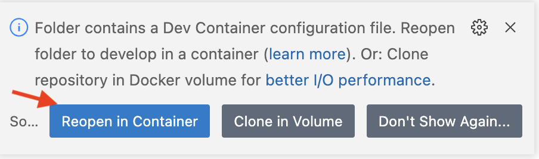

# timelink-project

 A timelink-mhk home with dev container. 

 This is a quick way to create a timelink-mhk instalation 
 to be run with docker.

## How to use

### Step one: download the Timelink instalations files

1. Open VS CODE with a new window.
2. Click on "Clone Git Repository..."

3. Click on "Clone from GitHub"

4. Type "joaquimrcarvalho/timelink-project" 

5 . Create a folder for the new project.

Click on "Select as Repository Destination"

6. When the download is finished click the 
"Open button" to confirm and open the project.

## Step two: generate the container to run timelink-mhk

The project contains a specification of a
"Container" to run timelink-mhk.

A "Container" is like a virtual computer 
that is created in your machine.

VS Code detects the Container configuration file
and offers to reopen the project inside the "Container"

The first time this is done it will take 
a long time as VS-Code (actually Docker behind
the scenes) creates the virtual machine.
